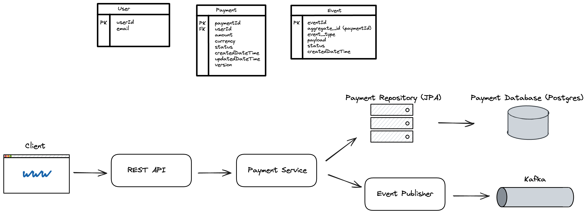
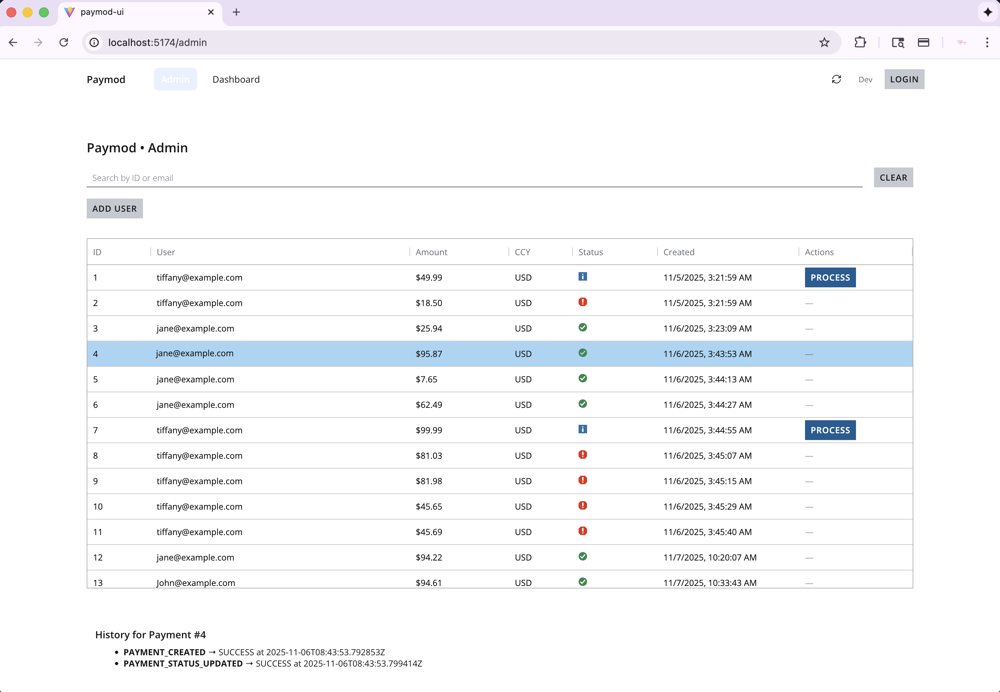
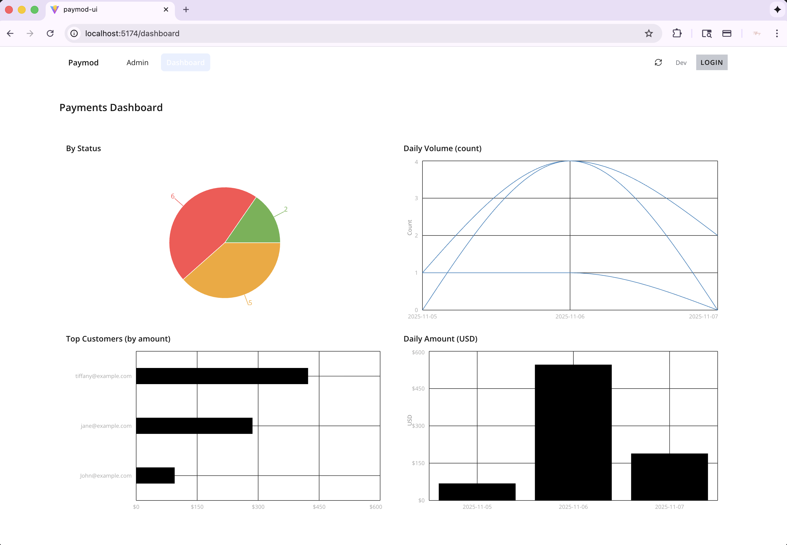
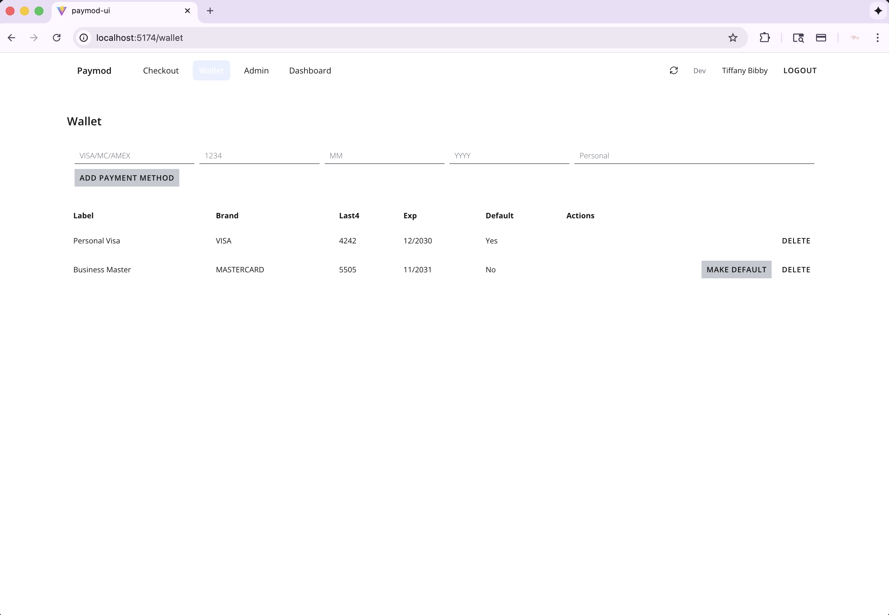
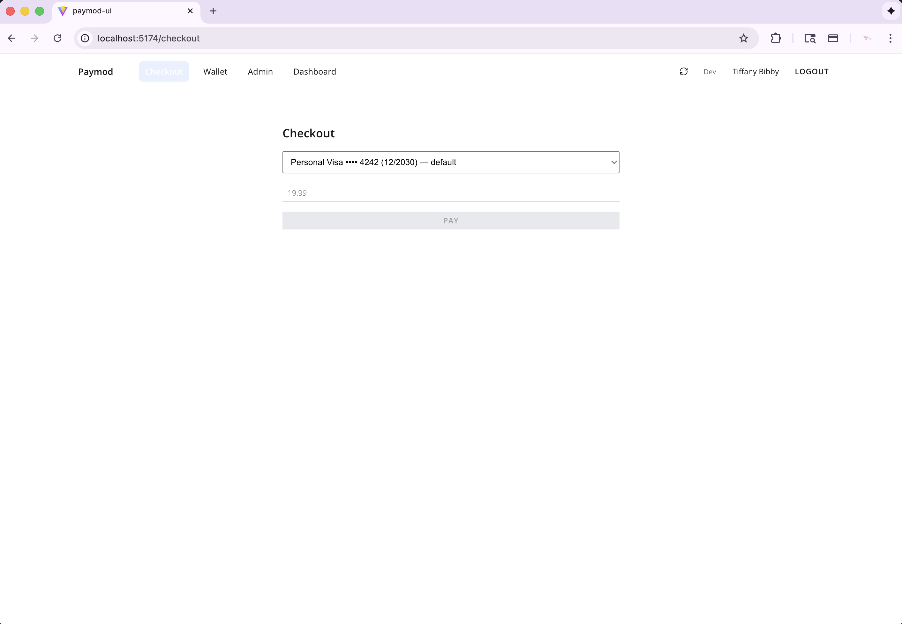

# PayMod
Payments Module utilizing Java, SpringBoot, JPA, Kafka

### TL;DR
- **Tech**: Spring Boot, JPA, Postgres, Kafka
- **Flow**: Controller → Service → Repo → DB → *(Event Publisher → Kafka)*
- **Status**: CRUD + status transitions; idempotency

### Goals
- Demonstrate end-to-end payment flow
- Practice clean layering, validation, error handling, and metrics/logging

### _Functional Requirements_
- payments service that accepts REST input
- persists payments data with JPA
- support status transitions (e.g. "pending", accepted", "failed")
- publish events to Kafka - create and status changes

### _Non-Functional Requirements_
- availability > consistency 
- strong consistency within service (DB); eventual consistency events consumers
- low latency
- horizontal scaling
- clean layering for maintainability (controller -> service -> service impl -> repo)

### _Capacity_ (assumptions)
- total users: ~1000
- daily active users: ~500
- payments per user per day: ~2
- Read-Write ratio: 3/1

## High-level architecture

**Request Flow (happy path)**
1. Client calls `POST /api/payments`
2. Controller validates, calls Service
3. Service Impl applies business logic, persists via JPA
4. On success, Service publishes `PaymentCreated` to Kafka
5. Consumer reacts asynchronously

### UI preview (Salt DS)

 
 
 

